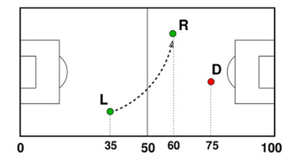

# L1 - Impedido!
### OBI 2015 - Fase 2 - Nível 1


## Motivação

A regra do impedimento no futebol pode parecer estranha, mas sem ela, se a gente pensar bem, o jogo ficaria muito chato! Ela funciona dadas as posições de três jogadores: L o jogador atacante que lança a bola; R o jogador atacante que recebe a bola; e D o último jogador defensor. E a regra vale somente se o jogador R está no seu campo de ataque; se o jogador R está no seu campo de defesa ou na linha divisória do meio campo, ele não está em impedimento. Neste problema o campo tem 100 metros de comprimento. Dadas as posições desses três jogadores, no momento exato do lançamento, haverá impedimento se e somente se a seguinte condição for verdadeira: **(R>50) e (L< R) e (R > D)**.

A regra parece estranha, não é mesmo? Mas a gente nem precisa entender a lógica dela. O seu programa deve apenas determinar, dadas as três posições L,R e D, se há ou não impedimento, implementando exatamente a condição acima. A figura abaixo mostra um exemplo onde \\bf não há impedimento:



## Entrada

- A entrada é composta 3 linhas, contendo os três inteiros L, R e D.

## Saída

- Seu programa deve produzir uma única linha, contendo um único caractere, que deve ser "S" caso haja impedimento, ou "N" caso contrário.

## Restrições

*   0 ≤ L ≤ 100
*   0 ≤ R ≤ 100
*   0 ≤ D ≤ 100

## Exemplos

```txt
>>>>>>>>
35
60
75
========
N
<<<<<<<<

>>>>>>>>
55
68
67
========
S
<<<<<<<<

>>>>>>>>
66
80
80
========
N
<<<<<<<<
```

