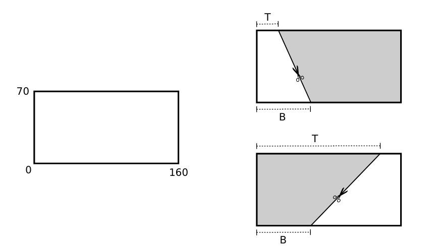

## L2 - Nota cortada - OBI 2019 F1P1
[](solver.cpp)

Se pegarmos uma nota de 100 reais e a cortarmos, usando uma tesoura, em dois pedaços, quanto vale cada um dos pedaços? A regra é simples: se um dos pedaços possuir estritamente mais da metade da área da nota original, então ele vale 100 reais; e o outro pedaço não vale nada. 

Veja que se cada pedaço possuir exatamente metade da área original, então nenhum dos dois tem valor. Felix e Marzia decidiram fazer um corte, em linha reta, que comece no lado inferior da nota, a base, e termine no lado superior, o topo. 

A nota é um retângulo de comprimento 160 centímetros e altura 70 centímetros, como mostrado na parte esquerda da figura abaixo. Felix sempre vai ficar com o pedaço mais à esquerda da nota e Marzia com o pedaço mais à direita. 

A parte direita da figura ilustra dois possíveis cortes. No de cima, Marzia ficaria claramente com o maior pedaço, que vale 100 reais; e no de baixo, dá para ver que Felix é quem ficaria com o maior pedaço.



O corte reto vai começar na base a uma distância de B centímetros a partir do lado esquerdo da nota; e terminar no topo a uma distância de T centímetros também a partir do lado esquerdo da nota. Veja a indicação na parte direita da figura. Neste problema, dados os valores B e T, seu programa deve computar quem vai ficar com o pedaço que vale 100 reais, ou se o valor da nota se perdeu. 

- Entrada
    - A primeira linha da entrada contém um inteiro B representando a distância do ponto inicial do corte, na base, para o lado esquerdo da nota.
    - A segunda linha da entrada contém um inteiro T representando a distância do ponto final do corte, no topo, para o lado esquerdo da nota.
- Saída
    - Seu programa deve imprimir uma linha contendo um número inteiro: 
        - 1, se Felix ficou com o pedaço que vale 100 reais; 
        - 2, se Marzia ficou com o pedaço que vale 100 reais; ou 
        - 0, se o valor da nota se perdeu.

## Testes
```
>>>>>>>>
50
86
========
2
<<<<<<<<

>>>>>>>>
70
90
========
0
<<<<<<<<

>>>>>>>>
130
138
========
1
<<<<<<<<


```
