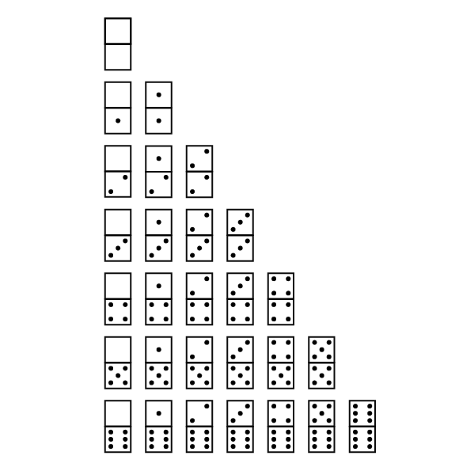

# L2 - Jogo de @domino - OBI 2019 F1PJ


O jogo de dominó tradicional, conhecido como duplo-6, possui 28 peças. Cada peça está dividida em dois quadrados e dentro de cada quadrado há entre 0 e 6 círculos. O jogo é chamado de duplo-6 justamente porque esse é o maior número de círculos que aparece num quadrado de uma peça. A figura ao lado mostra uma forma de organizar as 28 peças do jogo duplo-6 em 7 linhas. Essa figura permite ver claramente quantas peças haveria num jogo de dominó, por exemplo, do tipo duplo-4: seriam todas as peças das 5 primeiras linhas,15 peças no total. Também poderíamos ver, seguindo o padrão da figura, quantas peças possui o jogo de dominó conhecido como mexicano, que é o duplo-12. Seriam 91 peças, correspondendo a 13 linhas.



Para a nossa sorte, existe uma fórmula com a qual podemos calcular facilmente o número de peças de um jogo do tipo duplo-N, para um número N natural qualquer: ((N+1)*(N+2))/2. Neste problema,estamos precisando da sua ajuda para escrever um programa que, dado o valor N, use esta fórmula para calcular e imprimir quantas peças existem num jogo de dominó do tipo duplo-N.

- Entrada
  - A primeira linha da entrada contém um número natural N representando o tipo do jogo de dominó: duplo-N.
- Saída
  - Seu programa deve imprimir uma linha contendo um número natural representando quantas peças existem num jogo de dominó do tipo duplo-N.

## Exemplo

``` txt
>>>>>>>>
6
========
28
<<<<<<<<

>>>>>>>>
12
========
91
<<<<<<<<

```
