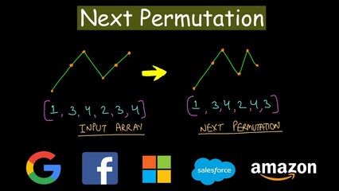

# L4 - @permutacao de fichas



## Motivação

Sara quer andar na montanha russa, mas para isso ela precisa esperar a sua vez na fila.

## Descrição

Sara tem um número de ficha, e lhe disseram que as fichas são geradas a partir de um número único seguindo os seguintes critérios:

- Cada ficha é gerada a partir da permutação lexicográfica da anterior.

- Se a última ficha gerada for a última permutação, as próximas fichas serão iguais.

### Exemplo

```txt
1° ficha = 123
2° ficha = 132
3° ficha = 213
4° ficha = 231
5° ficha = 312
6° ficha = 321
7° ficha = 321
...
```

Saiba mais: Permutações Lexográficas

## Ação

Sara tem medo de montanha russa, por isso ela vai comprar mais fichas para ir com as amigas.

Dada a ficha de Sara e o número de fichas seguintes que Sara comprou, determine o número da última ficha.

## Entrada

- 1 String S, representando a ficha de Sara.
- 1 Inteiro N, representando o número de fichas adicionais que Sara comprou.

### Saida

- O número da última ficha.

### Restricões

- length (S) <= 10;

- Seja S⁰ a primeira ficha, S¹ a segunda... S^n é permutação lexografica de S^(n-1).

## Exemplos

``` txt
>>>>>>>> Teste 0
123
5
========
321
<<<<<<<<

>>>>>>>> Teste 1
3215
1
========
3251
<<<<<<<<

>>>>>>>> Teste 2
4567
6
========
5467
<<<<<<<<
```
