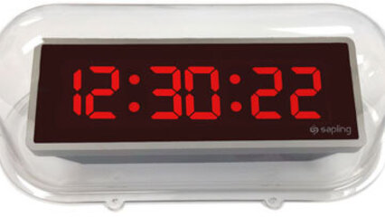

# L0 - Converte @segundos



## Ação

Em muitas situações do dia a dia, é necessário converter um tempo em segundos
para horas e minutos.

Implemente um programa que recebe um tempo em segundos e transformar no formato:

Hora:Minuto:Segundo

- A hora pode ser obtida pela divisão inteira do tempo por 3600.
- Agora pegue o resto de tempo por 3600, isso é o que sobrou pra minutos e segundos.
- A quantidade de minutos é obtida pela divisão inteira do resto por 60.
- O resto da divisão por 60 é a quantidade de segundos.

### Entrada

- Tempo em segundos

### Saída

- Tempo formatado em Horas:Minutos:Segundos

### Observação

- Pule uma linha com `'\n'` depois de mostrar a soma.
- Exemplo: std::cout << media << '\n';

## Exemplos

```
>>>>>>>> 0
3641
========
1:0:41
<<<<<<<<

>>>>>>>> 1
22067
========
6:7:47
<<<<<<<<

>>>>>>>> 2
9934
========
2:45:34
<<<<<<<<

>>>>>>>> 3
30100
========
8:21:40
<<<<<<<<

>>>>>>>> 4
22769
========
6:19:29
<<<<<<<<

>>>>>>>> 5
19324
========
5:22:4
<<<<<<<<

>>>>>>>> 6
15078
========
4:11:18
<<<<<<<<

>>>>>>>> 7
32958
========
9:9:18
<<<<<<<<

>>>>>>>> 8
30562
========
8:29:22
<<<<<<<<

>>>>>>>> 9
28064
========
7:47:44
<<<<<<<<

>>>>>>>> 10
9305
========
2:35:5
<<<<<<<<

>>>>>>>> 11
31745
========
8:49:5
<<<<<<<<

>>>>>>>> 12
26881
========
7:28:1
<<<<<<<<

>>>>>>>> 13
20427
========
5:40:27
<<<<<<<<

>>>>>>>> 14
13561
========
3:46:1
<<<<<<<<
```
