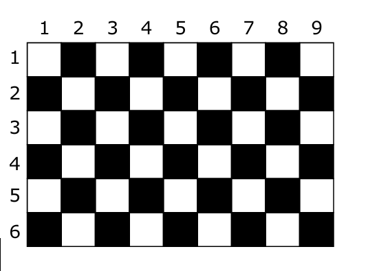

# L2 - @xadrez OBI 2019 F1P1

No tabuleiro de xadrez, a casa na linha 1, coluna 1 (canto superior esquerdo) é sempre branca e as cores das casas se alternam entre branca e preta, de acordo com o padrão conhecido como... xadrez! Dessa forma, como o tabuleiro tradicional tem oito linhas e oito colunas, a casa na linha 8, coluna 8 (canto inferior direito) será também branca. Neste problema, entretanto, queremos saber a cor da casa no canto inferior direito de um tabuleiro com dimensões quaisquer: L linhas e C colunas. No exemplo da figura, para L = 6 e C = 9, a casa no canto inferior direito será preta!



- Entrada
  - A primeira linha da entrada contém um inteiro L indicando o número de linhas do tabuleiro.
  - A segunda linha da entrada contém um inteiro C representando o número de colunas.
- Saída
  - Imprima uma linha na saída. A linha deve conter um inteiro, representando a cor da casa no canto inferior direito do tabuleiro:
    - 1, se for branca; e
    - 0, se for preta.

## Testes

``` txt
>>>>>>>>
6
9
========
0
<<<<<<<<

>>>>>>>>
8
8
========
1
<<<<<<<<

>>>>>>>>
5
91
========
1
<<<<<<<<

>>>>>>>>
401
322
========
0
<<<<<<<<
```
